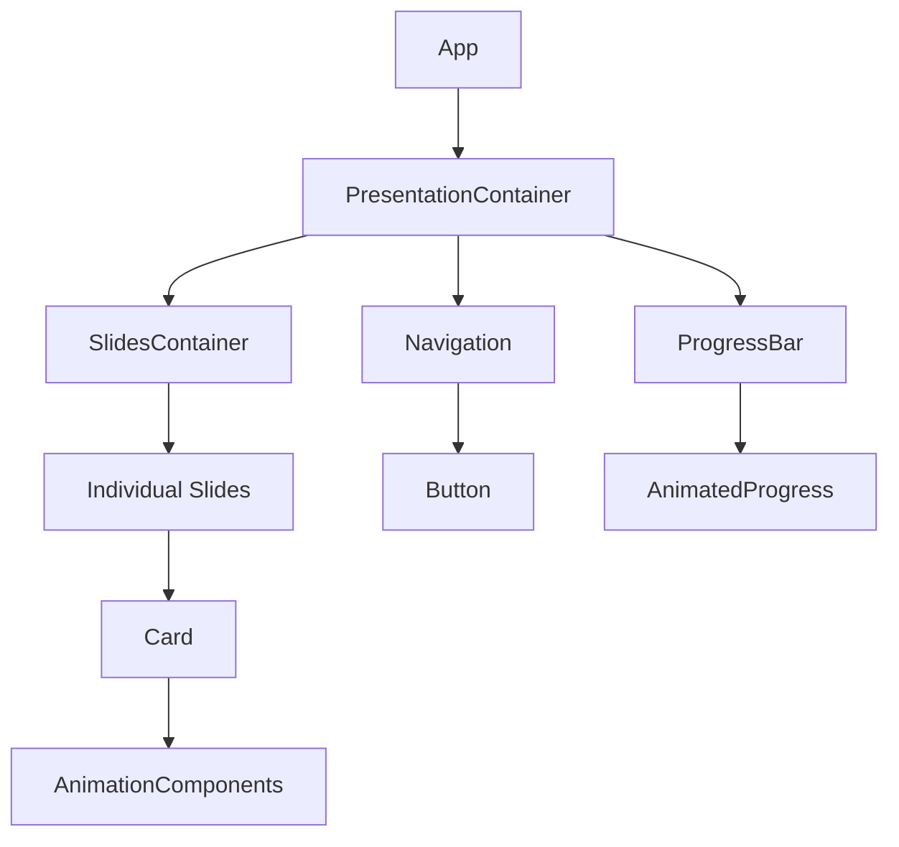

# Media X Presentation - React Architecture

Современное React приложение для презентации Media X с продвинутыми анимациями и интерактивными элементами.

## 🏗️ Архитектура проекта

### Технологический стек

- **React 18** с TypeScript
- **Vite** как сборщик
- **Zustand** для управления состоянием
- **Framer Motion** для сложных анимаций
- **Styled Components** для стилизации
- **GSAP** для продвинутых анимаций
- **React Spring** для физических анимаций

### Структура проекта

```
src/
├── components/           # Компоненты приложения
│   ├── slides/          # Компоненты слайдов
│   ├── ui/              # Базовые UI компоненты
│   ├── animations/      # Анимационные компоненты
│   └── navigation/      # Навигационные компоненты
├── hooks/               # Кастомные хуки
├── stores/              # Zustand хранилища
├── utils/               # Вспомогательные функции
├── styles/              # Глобальные стили и темы
├── types/               # TypeScript типы
└── assets/              # Статические ресурсы
```

### Компонентная иерархия



### Управление состоянием

Используется **Zustand** для централизованного управления состоянием:

```typescript
interface PresentationState {
  currentSlide: number
  totalSlides: number
  isAnimating: boolean
  direction: 'next' | 'prev'
  progress: number
  
  // Actions
  nextSlide: () => void
  prevSlide: () => void
  goToSlide: (index: number) => void
  setAnimating: (state: boolean) => void
  updateProgress: () => void
}
```

### Стилизация и анимации

#### Подход к стилизации
- **CSS Modules** для компонентных стилей
- **Styled Components** для динамических стилей
- **CSS Variables** для темизации
- **Темная/светлая** тема поддержка

#### Анимационные технологии
- **Framer Motion** для переходов между слайдами
- **GSAP** для сложных последовательностей
- **React Spring** для физических анимаций
- **Кастомные хуки** для специфичных эффектов

#### Типы анимаций
1. **Glitch-эффекты** текста
2. **Параллакс** при движении мыши
3. **Плавающие частицы** на фоне
4. **Плавные переходы** между слайдами
5. **Интерактивные hover-эффекты**
6. **Анимированные прогресс-бары**

### Компоненты слайдов

1. **TitleSlide** - Титульный слайд с главным заголовком
2. **ChallengeSlide** - Слайд вызовов с glitch-эффектами
3. **SolutionSlide** - Слайд решения с интерактивными карточками
4. **DepthSlide** - Глубина контента с анимациями
5. **NeuralSlide** - Нейросети с частицами
6. **MetricsSlide** - Метрики с анимированными графиками
7. **TechSlide** - Технологический стек с параллаксом
8. **PassageSlide** - Passage indexing с сложными переходами

### Производительность

- **Lazy loading** компонентов
- **Оптимизация анимаций** с GPU acceleration
- **Поддержка reduced motion**
- **Эффективное обновление состояния**

### Браузерная поддержка

- Modern browsers (Chrome, Firefox, Safari, Edge)
- Mobile responsive design
- Touch gestures support
- Keyboard navigation

## 🚀 Запуск проекта

```bash
# Установка зависимостей
npm install

# Запуск development сервера
npm run dev

# Сборка для production
npm run build

# Preview сборки
npm run preview
```

## 📦 Основные зависимости

- `react` & `react-dom` - React core
- `typescript` - TypeScript поддержка
- `vite` - Сборщик и dev server
- `framer-motion` - Анимации
- `@react-spring/web` - Физические анимации
- `gsap` - Продвинутые анимации
- `styled-components` - Стилизация
- `zustand` - Управление состоянием

## 🎨 Дизайн система

### Цветовая палитра
```css
:root {
  --primary-gradient: linear-gradient(135deg, #667eea 0%, #764ba2 100%);
  --secondary-gradient: linear-gradient(135deg, #f093fb 0%, #f5576c 100%);
  --accent-color: #ff6b6b;
  --text-primary: #2d3748;
  --text-secondary: #718096;
}
```

### Типографика
- **Заголовки**: Segoe UI, система шрифтов
- **Текст**: Читаемые sans-serif шрифты
- **Размеры**: Адаптивная типографика

## 🔧 Кастомизация

Проект легко кастомизируется через:
- CSS переменные для цветов
- Конфигурацию анимаций
- Настройку темы
- Добавление новых слайдов

## 📱 Responsive Design

Полная поддержка мобильных устройств:
- Адаптивная верстка
- Touch gestures
- Оптимизированные анимации
- Mobile-first подход
